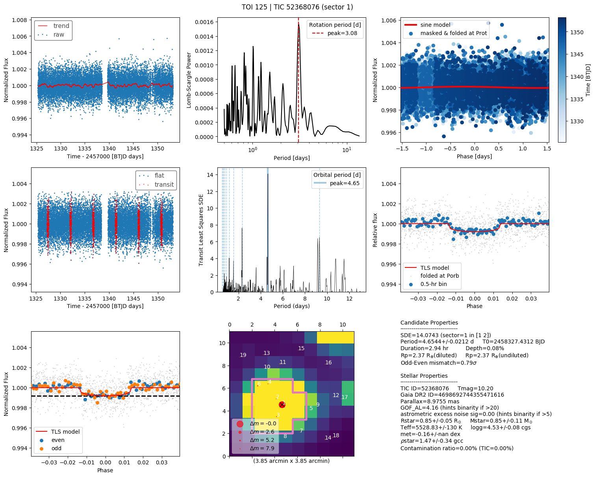

# TQL
[](https://travis-ci.com/jpdeleon/tql)
[](https://github.com/ambv/black)
[](https://www.gnu.org/licenses/gpl-3.0)

TESS Quick Look plot generator.
Note that [chronos](https://github.com/jpdeleon/chronos) is a dependency.

## Usage
```shell
optional arguments:
  -h, -help            show this help message and exit
  -gaia GAIA            Gaia DR2 ID
  -toi TOI              TOI ID
  -tic TIC              TIC ID
  -coords COORDS COORDS
                        08:09:10 -05:04:23 or 22.5 -12.56
  -name NAME            target name
  -sec SECTOR, -sector SECTOR
                        TESS sector
  -c {long,short}, -cadence {long,short}
                        30-min long or 2-min short (default)
  -sr SEARCH_RADIUS, -search_radius SEARCH_RADIUS
                        search radius in arcsec (default=3)
  -lc {pdcsap,sap,custom,cdips}, -lctype {pdcsap,sap,custom,cdips}
                        type of lightcurve
  -a {pipeline,round,square,percentile,threshold}, -aper_mask {pipeline,round,square,percentile,threshold}
                        aperture mask type
  -t THRESHOLD, -threshold THRESHOLD
                        mask threshold in sigma
  -r APER_RADIUS, -aper_radius APER_RADIUS
                        mask radius in pix
  -perc PERCENTILE, -percentile PERCENTILE
                        mask percentile
  -qb {none,default,hard,hardest}, -quality_bitmask {none,default,hard,hardest}
  -size CUTOUT_SIZE, -cutout_size CUTOUT_SIZE
                        FFI cutout size for long cadence (default=[12,12] pix)
  -m FLATTEN_METHOD, -flatten_method FLATTEN_METHOD
                        wotan flatten method (default=biweight)
  -w WINDOW_LENGTH, -window_length WINDOW_LENGTH
                        flatten method window length (default=0.5 days)
  -e EDGE_CUTOFF, -edge_cutoff EDGE_CUTOFF
                        cut each edges (default=0.1 days)
  -qm, -quality_mask   remove chunks of bad cadences identified in data
                        release notes
  -plims PERIOD_LIMITS PERIOD_LIMITS, -period_limits PERIOD_LIMITS PERIOD_LIMITS
                        period limits in periodogram search; default=(1,
                        baseline/2) days
  -b BIN_HR, -bin_hr BIN_HR
                        bin size in folded lc (default=4 hr if -c=long else
                        0.5 hr)
  -n NEARBY_GAIA_RADIUS, -nearby_gaia_radius NEARBY_GAIA_RADIUS
                        nearby gaia sources to consider (default=120 arcsec)
  -u, -use_priors      use star priors for detrending and periodogram
  -g, -gls             run GLS pipeline
  -f, -find_cluster    find if target in cluster
  -s, -save            save figure and tls
  -o OUTDIR, -outdir OUTDIR
                        output directory
  -v, -verbose         show details
```




## Examples
1. Show quick look plots of TOI 125 (with details printed in the terminal using -v)
$ tql -toi 125 -v

The generated figure shows 9 panels (see plot below):
* top row
 - left: background-subtracted, PLD-corrected lightcurve and trend
 - middle: lomb-scargle periodogram
 - right: phase-folded at peak stellar rotation period (if any)
* middle row
 - left: flattened lightcurve and transit (determined from TLS on the right)
 - middle: TLS periodogram
 - right: phase-folded lightcurve at orbital period
* bottom row
 - left: phase-folded lightcurve of odd and even transits with transit depth reference
 - middle: tpf with overlaid TESS aperture and annotated gaia sources
 - right: summary info
```
$ tql -tic 52368076 -v -s (uses pdcsap by default)
$ tql -toi 125.01 -v  -s -lc sap
$ tql -toi 125.01 -v -s -sec 2 (specify sector)
$ tql -toi 125 -v  -s -c long (long cadence)
$ tql -toi 125.01 -v -a pipeline (default aperture)
$ tql -toi 125.01 -v -a round -r 1 (round aperture 1 pix in radius)
$ tql -toi 125.01 -v -a square -r 2 (square aperture 2 pix in radius)
$ tql -toi 125.01 -v -a percentile -perc 90
$ tql -toi 125.01 -v -a threshold -t 5
$ tql -toi 125.01 -v -a threshold -g (gls periodogram)
```

## Advanced usage
If you would like to run tql on a list of TIC IDs (saved as new_tics.txt), then we have to make a batch script named run_tql_new_tics.batch. Its output files containing the plots (*.png) and tls_results (*.h5) will be saved in new_tics directory:
```
$ cat new_tics.txt | while read tic; do echo tql -tic $tic -pld -s -o ../new_tics; done > run_tql_new_tics.batch
```
To test the Nth line of the batch script,
```
$ cat run_tql_new_tics.batch | sed -n Np | sh
```
To run all the lines in parallel using N cores (use -j<48 cores so that muscat-ut will not be very slow!),
```
$ cat run_tql_new_tics.batch | parallel -j N
```
After the batch script is done, we can rank TLS output in terms of SDE using rank_tls script:
```
$ rank_tls indir
```

## To do
* find additional planets by iterative masking of transit
* implement vetting procedure in sec 2.3 of [Heller+2019](https://arxiv.org/pdf/1905.09038.pdf)
  - SDE>9
  - odd_even_mismatch < 3σ
* take note of [rolling bands](https://docs.lightkurve.org/tutorials/04-identify-rolling-band.html) in TESS, if there is any, which may be solved with background subtraction
* orient image properly to to show easy comparison with panel 1 and 2 (currently image is simply inverted!)
